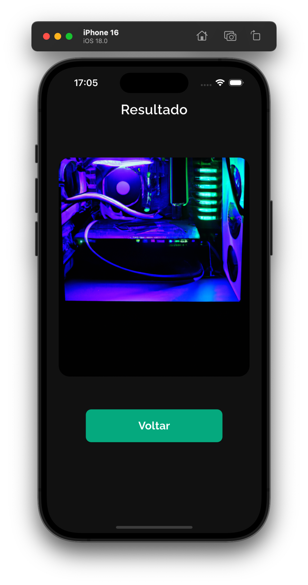

<h2 align="center">Midjourney App<h2>
<p align="center">
    
</p>

   <h2>Topics 📋</h2>

  <p>
   
   - [About 📖](#about-)
   - [Preview 📱](#preview-)
   - [Technologies Used 👨🏽‍💻](#---technologies-used----)
   - [How to Use 🤔](#how-to-use-)
   </p>

   <h2>About 📖</h2>
   
   <p>
    Midjourney App é uma ferramenta de criação de imagens via prompt, que consiste em uma instrução para que a inteligência artificial possa gerar a imagem pedida. Utiliza o api oficial do ChatGPT com features como remote config do Firebase para maior segurança de armazenamento da Api Key dentro do aplicativo.
   </p>

---

   <h2>Preview 📱</h2><br>

   <p a>
     
     
   </p>

---

 <h2>
   Technologies Used 👨🏽‍💻
   </h2>
   
- **bloc** -> Gerenciador de estado.
- **dio** -> Pacote de rede para efetuar requisições http.
- **freezed** -> Gerador de código para classes de estados e eventos do bloc.
- **google_fonts** -> Utilização de fontes nativa do Google.
- **firebase_remote_config** -> Utilização do recurso de remote config do Firebase.

---

   <h2>How to Use 🤔</h2>

```
- Clone this repository:
$ git clone https://github.com/Franciscof11/Midjourney_App.git MidjourneyApp

- Enter in directory:
$ cd MidjourneyApp

- For install dependencies:
$ flutter pub get

- Connect your emulator or physical device

- Run the app:
$ flutter run
```

---

This project was developed by **[@Francisco Gabriel](https://www.linkedin.com/in/franciscossg/)**,
if it helped you, give ⭐, it will help me too 😉.

---

   <div>

[](https://www.linkedin.com/in/franciscossg/)

   </div>

